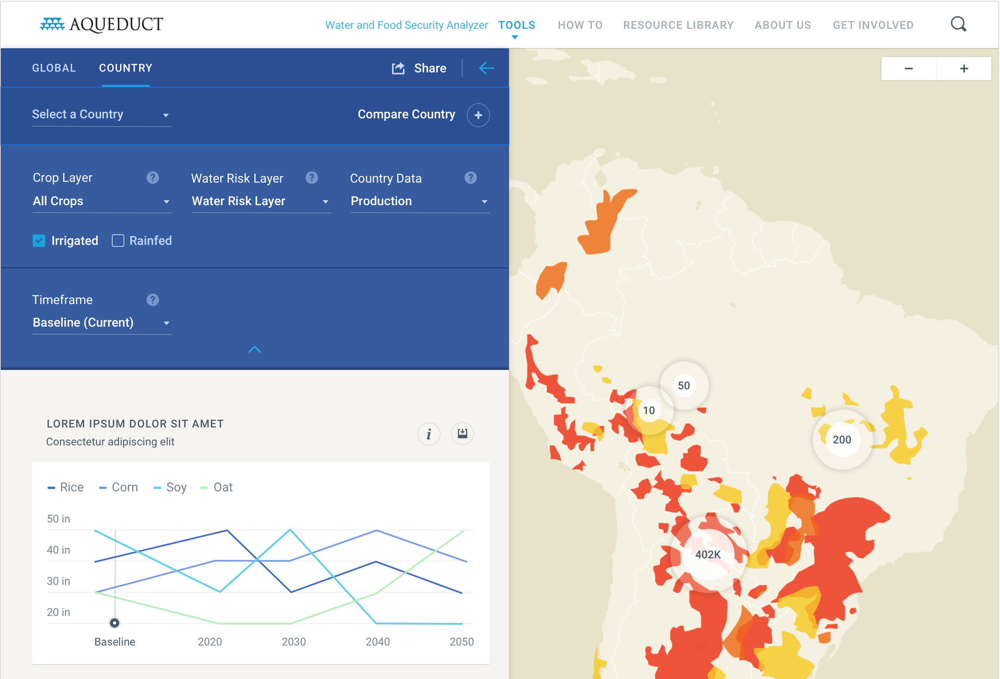

# Aqueduct Water and Food Security Analyzer

Aqueduct is a set of tools developed by World Resources Institute designed to identify and analyze water risk around the world. The Water and Food Security Analyzer provides data and insights into how crops are affected by water resources. For further information see [https://www.wri.org/aqueduct](https://www.wri.org/aqueduct)

This tool uses the IFPRI IMPACT Model: [https://www.ifpri.org/program/impact-model](https://www.ifpri.org/program/impact-model)

## Getting Started

1. Install Docker.
2. Clone the repo.
3. Copy `.env.sample` to `.env` and set variables.
4. Run `docker-compose up`. Visit localhost:3040.

## Git Flow

1. Create all new branches by branching off `develop`.
2. Open pull requests against `develop` as well.
3. Merge branches into `develop` when they are ready to be deployed for testing.
4. When a change is ready to be deployed to the production website, merge `develop` into `main`.

## Deployment

### Deploying to staging

1. Run `docker-compose run web yarn build` to compile.
2. Copy the contents of the `build` directory to the `wriorg` repo.
    - Make sure you are on the `aqueductgr2` branch of the `wriorg` repo.
    - Copy the build to the `wriorg/applications/aqueduct/food` directory.
    - This command may work for you too: `rsync -a build/ ../wriorg/applications/aqueduct/food/`
3. From the `wriorg` repo, commit and push changes to the `aqueductgr2` branch. Enter your Pantheon password when/if prompted.
    - In your commit message, include the app name and the hash for the commit from that app's repo that you are deploying, for example:
      > Update aqueduct-flood to commit 8df15603a5d939995b03ade0429f90434a19e6ca
    - The app is deployed on push to https://aqueductgr2-wriorg.pantheonsite.io/applications/aqueduct/food/

### Deploying to production

To deploy to production, follow the same steps as above but use the `aqueduct-gr` branch of the `wriorg` repo instead of the `aqueductgr2` branch. You must then ask WRI staff to merge and promote the update to production.
